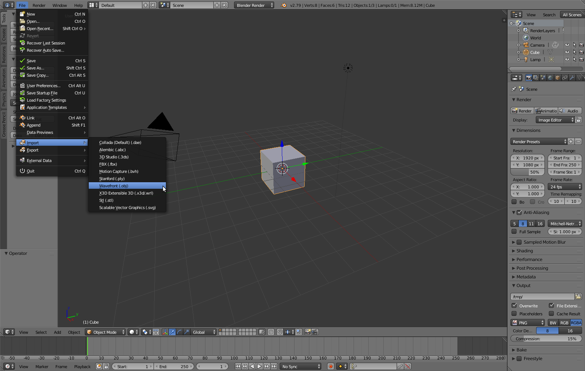
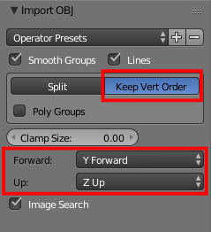
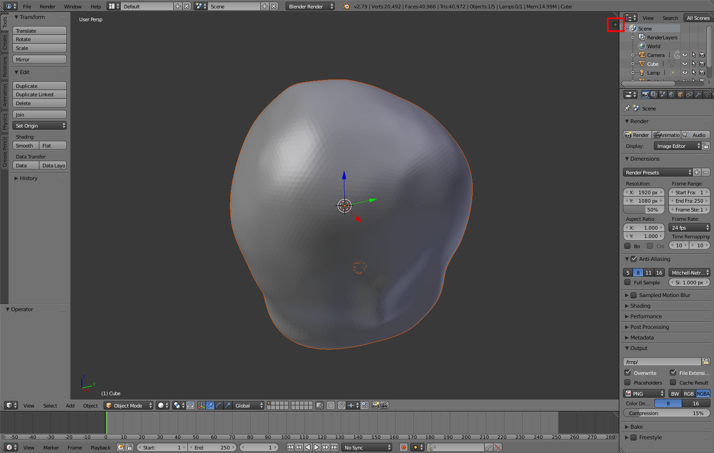
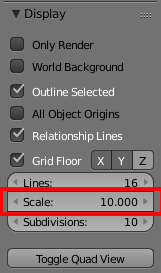
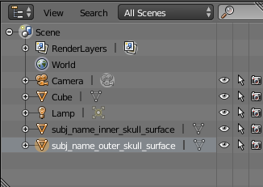
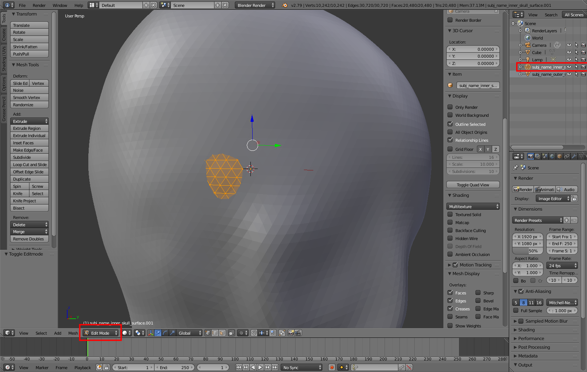
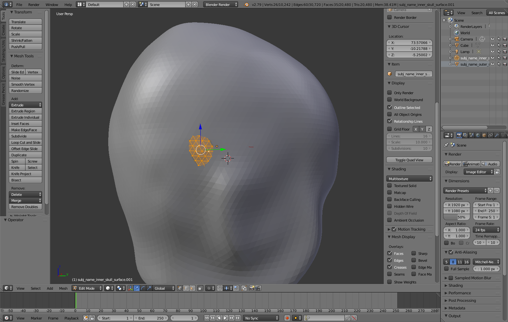
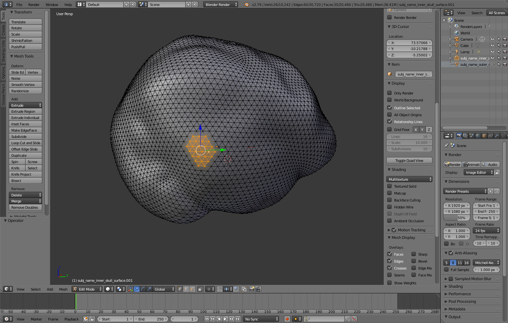
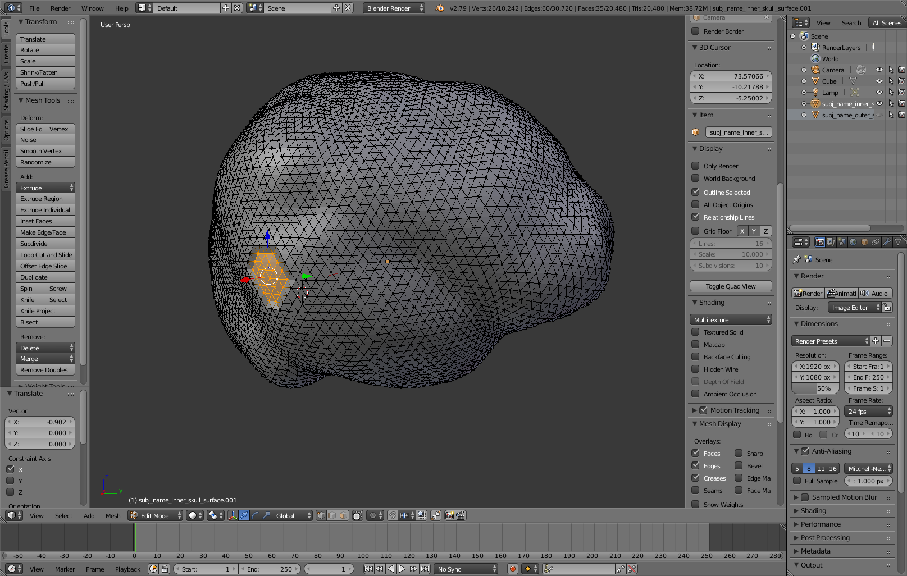
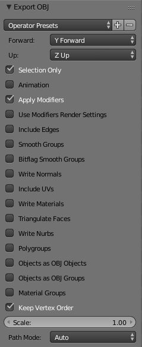

# Blender and Freesurfer
### Editing freesurfer sufaces in Blender for BEM modeling

Sometimes when creating a BEM model the surfaces need manual correction because of a series of problems that can arise (e.g. intersection between surfaces). Here, we will see how this can be achieved in Blender.

#### Steps
1. Convert surfaces from freesurfer format to ascii
2. Convert from ascii to .obj format
3. Edit in Blender
4. Convert from .obj to ascii
5. Convert from ascii to freesurfer format

#### What do you need?
* [Freesurfer](https://surfer.nmr.mgh.harvard.edu/)
* Surfaces (e.g. [mne.bem.make_watershed_bem](https://mne-tools.github.io/stable/generated/mne.bem.make_watershed_bem.html))
* [Brainder's](https://brainder.org/2012/05/08/importing-freesurfer-cortical-meshes-into-blender/) conversion functions ([srf2obj]() and [obj2srf]())
* [Blender](https://www.blender.org/)
* (Using a mouse will make the edition in Blender easier)

#### Installation
Please refer to each package's website for specific instructions.


### 1 & 2. From freesurfer to .obj
We will transform the surfaces to .obj so that they can be imported in Blender. In order to do this we will use [Brainder's](https://brainder.org/2012/05/08/importing-freesurfer-cortical-meshes-into-blender/) conversion functions. First we have to go from freesurfer to ascii and then from ascii to .obj format. This can be done manually (e.g. entering the commands in a terminal) or using the bash script [to_blender.sh](https://github.com/ezemikulan/blender_freesurfer/blob/master/to_blender.sh), which will do the conversion for all the surfaces created by [mne.bem.make_watershed_bem](https://mne-tools.github.io/stable/generated/mne.bem.make_watershed_bem.html)). For instructions on how to do it manually see [Brainder's](https://brainder.org/2012/05/08/importing-freesurfer-cortical-meshes-into-blender/). If you do it manually, make sure to create a backup of the original freesurfer surfaces.

The script [to_blender.sh](https://github.com/ezemikulan/blender_freesurfer/blob/master/to_blender.sh) takes 3 arguments:
1. Subjects name in freesurfer's subjects directory
2. Path to freesurfer's subjects directory
3. Path to the directory where Brainder's functions are located

```console
foo@bar:~$ to_blender.sh subj_name /path/to/freesurfer/subjects/directory /path/to/Brainder/functions
```

It will create a folder named *conv*, which will contain:
* Backups of the original surfaces
* Surfaces in ascii format
* Surfaces in .obj format

### 3. Edit in blender
We will import the surfaces in Blender, make the changes we need, and then export the new mesh in .obj format.

1. Open blender.

2. Go to *File > Import > Wavefront (.obj)*. Make sure to select the *Keep Vert Order* option. You can also select the *Y Forward* option to load the axis in the correct direction (RAS):




3. Repeat for all surfaces you want to import (e.g. inner_skull and outer_skull)

4. Zoom out using the mouse wheel:

5. Click on the plus sign on the top right corner of the 3D view :



6. Go to Display and set scale to 10. You can also make the grid invisible by unchecking *Grid Floor*:

   

   You can toggle the visibility of an object from the Outliner panel :

   

   To rotate the view click the mouse wheel and drag.

7. Find the vertices you need to edit. It is useful to go to the Edit mode and select the inner surface. This will highlight all the vertices and edges of the inner surface. If there are vertices that are outside of the outer surface you should be able to see them:



8. in *Edit mode*, right click one of the vertices that you want to correct in order to deselect all and select a single vertex.

9. Press the *C* key to activate the *Circle Select* tool (or *B* for *Box Select*). You can enlarge the area using the mouse wheel.

10. Use the left click to select the area to edit. You can click multiple times or click and drag:




11. Rotate the view to a good angle and use the arrows to edit the position of the selected vertices :



12. Select the whole surface in the *Outliner* panel. Go to *File > Export > Wavefront (.obj)*. Navigate to the *conv* folder. Add *_edit* to the surface's original name. Set the options as follows :

   

   Make sure to have the *Selecttion Only* and *Keep Vertex Order* options turned on.

### 4 & 5. From .obj to freesurfer
We will finally convert the edited meshes to freesurfer format. First we will go from .obj to ascii and then from ascii to freesurfer surface. Again, you can do this manually, or use the script [from_blender.sh](https://github.com/ezemikulan/blender_freesurfer/blob/master/from_blender.sh). The script takes the same input parameters as to_blender.sh. It will create a freesurfer surface that will end in *_edit*. Then you can manually copy the file to the watershed folder (where the original files were located) and rename it as the original files. This step is done manually because it implies overwriting the original surface (or having a new file that has the same name as the original) and therefore is better to do it when you are sure. Recall that [to_blender.sh](https://github.com/ezemikulan/blender_freesurfer/blob/master/to_blender.sh) created backups of the original files so you can restore them when you want.

That's it. You are ready to continue with your analysis pipeline (e.g. running [mne.make_bem_model](https://mne-tools.github.io/stable/generated/mne.make_bem_model.html#mne.make_bem_model))
